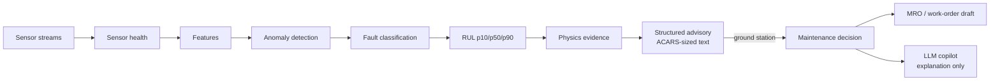
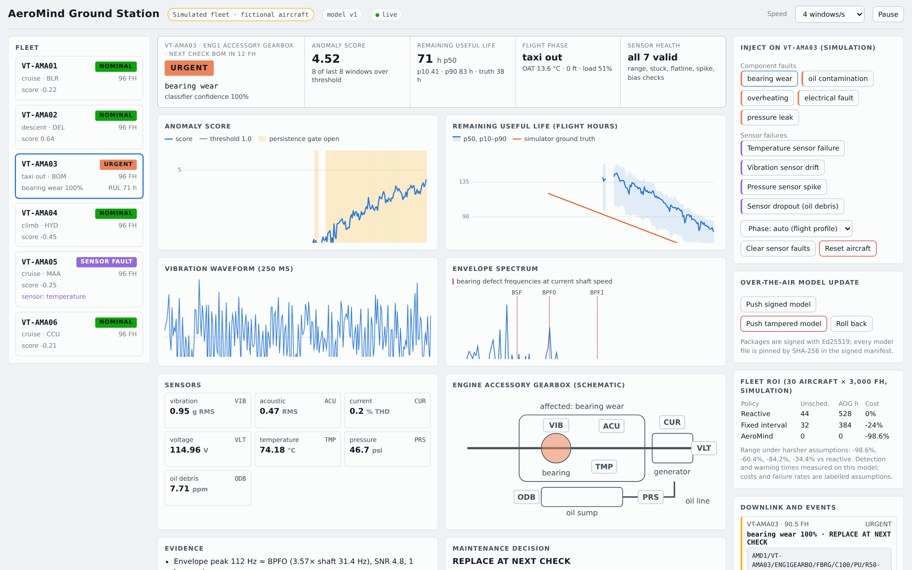

# AeroMind

**Real-time onboard AI for predictive aircraft health and maintenance intelligence.**
A research prototype: deterministic edge intelligence on the aircraft side, a ground station with a
maintenance decision engine, and an optional ground-side LLM copilot that explains the results.

> **Everything runs on simulated data** (an in-repo sensor simulator, plus two public NASA datasets
> used offline). There is no flight data, no airline or OEM involvement, no certification, no real ACARS/SWIM/MRO
> connection, and no Jetson, FPGA or Raspberry Pi measurement. Numbers describe software behaviour on a
> synthetic simulator, not performance on aircraft. See [Limitations](#limitations).

### How to read the status tags

| Tag | Meaning |
|---|---|
| **IMPLEMENTED** | The code exists and is covered by tests |
| **MEASURED** | A number produced by a command in this repository (`python -m aeromind report`) |
| **SIMULATED** | Uses the in-repo simulator, not real data |
| **REAL DATASET** | Uses a public real or benchmark dataset (NASA IMS, NASA C-MAPSS) |
| **UNVALIDATED HARDWARE** | Prepared for hardware that has not been run |
| **ROADMAP** | Not built |

## Overview

AeroMind watches seven sensor channels on one component per aircraft (the demo uses an engine accessory
gearbox). On the aircraft it separates failing *sensors* from failing *components*, detects persistent
anomalies, names the fault, estimates remaining useful life with an uncertainty band, and backs the call
with physics computed from the raw signals. Only a short structured advisory (about 140 characters in
ACARS form) goes to the ground. On the ground, a decision engine turns each advisory into a risk-based
maintenance recommendation and a work-order draft, and an optional LLM copilot explains it in plain language.

## Problem

Maintenance is scheduled or reactive, degradation is found late, and unplanned aircraft-on-ground events are
expensive. Raw sensor streams are too large to send down, and a bare "anomaly" flag does not tell an engineer
what to look at or how long they have.

## Solution

```
 sensors -> sensor health -> features -> anomaly -> fault -> RUL -> physics evidence -> decision -> advisory
 (edge, deterministic)                                                  (ground)        (ACARS-sized)
                                                                              LLM copilot explains, never decides
```

## Architecture



The full diagram, code map and the question "who answers what" are in [docs/architecture.md](docs/architecture.md).
The deterministic pipeline is the source of technical truth; the LLM is **ground-side** and only explains.

## Edge Intelligence

`aeromind.edge.pipeline.EdgePipeline` turns one sensor window into zero or more advisories. The same pipeline
runs in the simulated fleet, the CLI and the standalone `aeromind edge-agent`; models run in ONNX Runtime (FP32, CPU).
**IMPLEMENTED, SIMULATED.** Measured on a development CPU, not on aircraft hardware: 1.8 MB of models and about
1.2 ms per window on one thread (**MEASURED**, x86-64 Linux CPU; see [docs/evidence-report.md](docs/evidence-report.md)).

## Sensor Health

Every window is checked per channel before feature extraction: NaN, out of range, flatline, stuck, bias, spike, rate.
A faulty channel is reported once as `SENSOR_FAULT` and masked, so monitoring continues in degraded mode instead of
mistaking a broken probe for a failing gearbox. **IMPLEMENTED, SIMULATED, MEASURED:** 0 false sensor faults in 5,400
clean windows; seven kinds of injected failure were flagged in 1 to 11 windows with 0 component advisories (without the
layer, up to 38 false component advisories per scenario). Slow in-range drift is not detected.

## Anomaly Detection

Isolation Forest plus an autoencoder, calibrated so 1.0 is the 99th percentile of healthy windows, with flight-phase,
outside-air-temperature and altitude context, and a persistence gate (advisory after 5 of the last 8 windows over threshold).
**MEASURED, SIMULATED:** with flight-phase awareness the gate is open on 0.0% of healthy flight windows (98.6% without);
0.0 false advisories per 1,000 healthy windows.

## Fault Classification

Gradient-boosted trees on context residuals (each feature's deviation from its healthy value at the current load,
temperature and altitude) name one of five faults (bearing wear, oil contamination, overheating, electrical fault,
pressure leak) or `unclassified_anomaly` early on. **MEASURED, SIMULATED:** correct at the first classified alert in
29 of 30 runs in the published report (28 of 30 in a re-run on Windows; see [docs/technical-notes.md](docs/technical-notes.md)). The simulator's faults are cleaner than real ones.

## Remaining Useful Life

RUL is reported as p10 / p50 / p90 flight hours from quantile gradient boosting (default) or an optional PyTorch LSTM,
with an optional conformal interval. **MEASURED:** on the simulator, p10-p90 coverage is 0.74 to 0.99 (nominal 0.80);
on **REAL DATASET** NASA C-MAPSS (official test split) RMSE is 19.4 / 17.7 / 22.3 / 20.1 cycles for trees and
16.0 / 14.6 / 16.1 / 15.8 for the LSTM on FD001 to FD004 (constant baseline 48.5 to 62.9). RUL is an estimate, not a guarantee.

## Physics-backed Explainability

Evidence in each advisory is computed from the raw signals, independently of the classifier: the envelope spectrum is
searched for the bearing outer/inner-race and ball-spin defect frequencies (BPFO / BPFI / BSF), and the current for
3rd and 5th harmonic distortion. **MEASURED, REAL DATASET:** on NASA IMS bearing data, the first alarm precedes the
outer-race failure by 74.8 h and the BPFO line identifies the failing bearing in 98.9% of snapshots. The bearing geometry in the
simulator is an assumption.

## Maintenance Decision Engine

The RUL quantiles define a failure-time distribution; the engine computes the probability of failure during the next leg
and before the next check, and returns `GROUND_NOW`, `REPLACE_AT_NEXT_CHECK` or `DEFER_AND_MONITOR` with the rationale,
cost if planned and expected cost if deferred. **IMPLEMENTED; prototype policy, not a certified maintenance procedure;
costs are labelled assumptions.** Work orders are drafts.

## Fleet ROI

A 30-aircraft, 3,000 flight-hour simulation compares reactive, fixed-interval and AeroMind maintenance, with a
sensitivity table. **SIMULATED, MEASURED detection and warning times with ASSUMED costs and failure rates:** AeroMind
-98.6% cost versus reactive as measured on the simulator, and -34.4% under harsh assumptions (67% detection, 10% of the
warning time, 5 false advisories per 1,000 windows, AOG $10k/h instead of $150k/h).

## ACARS-sized Advisory

Every advisory is encoded into one compact text block of at most 220 characters and decoded back in tests.
**MEASURED:** 68 messages, maximum 141 and mean 105.4 characters. **There is no ACARS connection;** this is an encoding only.
Compared with streaming raw samples, the downlink is 545x smaller (simulator).

## Signed OTA Model Updates

Model packages are signed with Ed25519 over a SHA-256 manifest. The ground station accepts a valid package, rejects a
tampered one (one flipped byte) and keeps the last valid model active; rollback is supported. **IMPLEMENTED, tested,
demonstrated between in-process aircraft.** No real aircraft datalink or key-management service exists.

## Federated Learning

FedAvg of autoencoder and classifier weights across simulated aircraft. **MEASURED, SIMULATED:** an aircraft that has seen
only 2 of 5 fault types recognises the other 3 with 91% accuracy after federation (local only: 0%). For anomaly detection
federation showed **no measurable advantage** in the tested setup.

## LLM Maintenance Copilot

A **ground-side** assistant that explains deterministic output: explain an alert, summarise an aircraft, why this fault,
explain RUL, what maintenance might inspect, draft a work order, explain a what-if, summarise the fleet. It receives a
controlled structured summary (never raw sensor data), must return schema-valid JSON, passes safety checks (no invented
numbers, faults or aircraft; no certification claims; no control commands; no overriding the deterministic decision), gets one
repair retry, and otherwise falls back to a rule-based template. Providers: **Groq** (primary) then **Ollama** (local)
then template; it works fully with no key and no internet. Every answer is labelled AI-generated or template.
**IMPLEMENTED; tested with mocked providers. Live-model answer quality has not been evaluated.** Details: [docs/llm.md](docs/llm.md).

## Ground Station

`python -m aeromind serve` starts a FastAPI + WebSocket dashboard with six simulated aircraft, live fault injection (five
component faults, four sensor failures), flight-phase control, decisions with a what-if slider, work orders, the ROI panel,
OTA push/tamper/rollback, remote edge devices, and the **AI Maintenance Copilot** panel. Deterministic output and AI text
are shown in separate, labelled blocks, and **LLM STATUS** (`ONLINE`, `LOCAL`, `FALLBACK`, `UNAVAILABLE`) is always visible.



*Screenshot of the ground station from before the copilot panel was added; the panel sits below the evidence and decision cards.*

## Datasets

| Dataset | Use | Tag |
|---|---|---|
| In-repo simulator | training, evaluation, demo | SIMULATED |
| NASA C-MAPSS (Saxena and Goebel, 2008) | RUL benchmark, 4 subsets; downloaded on demand (about 12 MB) | REAL DATASET (simulated engines) |
| NASA IMS bearing run-to-failure | envelope-spectrum evidence and early warning; about 1.1 GB, downloaded on demand | REAL DATASET |

CWRU and N-CMAPSS were not run.

## Evaluation

`python -m aeromind evaluate` runs fresh simulated runs through the pipeline (detection, lead time, classification, RUL error
and coverage, false advisories, downlink). `python -m aeromind report` regenerates every number into `artifacts/report/`
(`results.json`, `report.md`, about 15 minutes with datasets present).

## Measured Results

From [docs/evidence-report.md](docs/evidence-report.md) (generated by `python -m aeromind report`; simulator results are SIMULATED,
IMS and C-MAPSS are REAL DATASET results):

| Item | Result |
|---|---|
| Detection, simulator with flight phases | all 5 fault types detected in 6/6 runs each, median warning 74.8 to 163.0 h before failure |
| False advisories | 0.0 per 1,000 healthy windows |
| Fault named correctly at first classified alert | 29 of 30 runs (28 of 30 in the Windows re-run) |
| Sensor failures | 0 false sensor faults in 5,400 clean windows; flagged in 1 to 11 windows |
| ACARS size | max 141 / 220 characters |
| Downlink vs raw samples | 545x smaller |
| NASA IMS | alarm and BPFO evidence about 74.5 to 74.8 h before the outer-race failure |
| C-MAPSS RMSE (trees + conformal / LSTM) | 19.4 / 17.7 / 22.3 / 20.1 and 16.0 / 14.6 / 16.1 / 15.8 |
| Edge, laptop-class CPU | 1.8 MB models, about 1.2 ms per window, one thread |
| Raspberry Pi 5 / Jetson | **no measurements (PENDING / UNVALIDATED HARDWARE)** |

The simulator, sensor-health, ACARS and ROI sections were re-run after the V2 restructure and agree with the published report to within small, documented differences (same file). Earlier detailed tables (ONNX parity, TensorRT-compatible export, LSTM comparison, original baseline) are kept in
[docs/technical-notes.md](docs/technical-notes.md), including the audit baseline re-run before the V2 work.

## Demo

[docs/demo.md](docs/demo.md) is the run sheet: start the ground station, inject bearing wear, watch the anomaly gate, classifier,
RUL, physics evidence, decision and ACARS line, ask the copilot, draft a work order, inject a temperature sensor failure
(`SENSOR_FAULT`, channel masked), push a signed model, push a tampered one (rejected), keep the previous model.

## Installation

Python 3.10 to 3.12.

```bash
git clone <this repository> && cd AeroMind
python -m venv .venv && source .venv/bin/activate
pip install -e ".[app]"        # ground station + ONNX runtime
pip install -e ".[dev]"        # tests (adds pytest and httpx); add ,lstm for the PyTorch LSTM
python -m aeromind serve       # first start trains a flight-phase model (~20 s); open http://127.0.0.1:8000
```

## Windows Quick Start

PowerShell:

```powershell
git clone <this repository>
cd AeroMind
py -3.11 -m venv .venv
.venv\Scripts\Activate.ps1      # if blocked: Set-ExecutionPolicy -Scope Process RemoteSigned
pip install -e ".[app]"
python -m aeromind serve
```

Then open http://127.0.0.1:8000. Everything runs offline.

## LLM Setup

The copilot works without any setup (template answers, shown as `FALLBACK`). To use a real model, set up Groq and/or Ollama.
Copy `.env.example` to `.env` (git-ignored); environment variables take precedence. Check with:

```bash
python -m aeromind llm doctor
```

## Groq Setup

1. Create an API key at https://console.groq.com.
2. In `.env`: `GROQ_API_KEY=...` (optionally `GROQ_MODEL=...`; the default may be retired by Groq over time).
3. `python -m aeromind llm doctor --ping` sends one tiny request. Status becomes `ONLINE`.

Groq is a cloud service: the structured context of the aircraft you ask about is sent to it. Never commit `.env`.

## Ollama Setup

1. Install Ollama from https://ollama.com, run `ollama pull llama3.2`, keep `ollama serve` running.
2. `python -m aeromind llm doctor` should show the model pulled. Status becomes `LOCAL` when Groq is not configured.
3. To force local-only: `AEROMIND_LLM_PROVIDER=ollama`. To disable LLMs: `AEROMIND_LLM_PROVIDER=off`.

## CLI Reference

`python -m aeromind <command>` (or `aeromind <command>` after installing).

| Command | Purpose |
|---|---|
| `train` | train models on simulated data (`--rul lstm`, `--phases`, `--conformal`) |
| `export-onnx` | export the bundle to ONNX and check parity (`--trees hummingbird` for TensorRT-compatible graphs) |
| `demo` | stream one simulated run through the pipeline (`--mode`, `--backend onnx`) |
| `evaluate` | closed-loop metrics on fresh simulated runs |
| `serve` | ground station (`--host`, `--port`, `--speed`) |
| `report` | regenerate every metric into `artifacts/report/` (`--lstm` adds the LSTM) |
| `cmapss` | NASA C-MAPSS RUL benchmark (downloads data if missing) |
| `ims` | NASA IMS real bearing run-to-failure (about 1.1 GB download) |
| `roi` | fleet maintenance cost simulation and sensitivity |
| `bench` | edge size, load time, latency, throughput, memory (`--target laptop|raspberry-pi`, `--compare`) |
| `federated` | FedAvg demo (`--rare-fault` for the fault-sharing experiment) |
| `dashboard` | self-contained HTML replay of simulated runs |
| `edge-agent` | run the edge pipeline as a service and send advisories to a ground station |
| `copilot` | LLM maintenance copilot in the terminal (`--aircraft`, `--inject`, `--ask`, `--task`) |
| `llm doctor` | provider configuration and availability, never prints secrets (`--ping`) |

## Repository Structure

```
src/aeromind/
  core/            config, simulator, features, advisory schema, training
  models/          anomaly, classifier, RUL (trees, LSTM), conformal
  edge/            pipeline, sensor health, ONNX export/runtime, bench, edge agent
  physics/         envelope-spectrum and harmonic evidence
  maintenance/     decision engine, work orders, fleet ROI
  communications/  ACARS-sized encoding
  security/        signed model packages and rollback
  learning/        federated learning
  datasets/        NASA C-MAPSS and IMS loaders
  evaluation/      closed-loop evaluation
  report/          evidence report, static HTML dashboard
  llm/             providers, router, context, prompts, schemas, safety, fallback, knowledge, copilot
  server/          ground station (FastAPI), simulated fleet, remote ingest
  web/index.html   ground-station page
  cli.py           the aeromind command
tests/             unit, integration, llm, e2e
docs/              architecture, demo, llm, deployment, limitations, technical report, evidence, knowledge/
deploy/            raspberry-pi (prepared), jetson (kit, unvalidated)
tools/             deck and pre-read builders (read numbers from docs/evidence-report.md)
```

## Raspberry Pi Deployment

**Prepared, not run on hardware: results PENDING.** A Raspberry Pi 5 (64-bit OS) runs `aeromind edge-agent`, the same
`EdgePipeline` with ONNX Runtime, and sends advisories to the laptop's ground station; the LLM stays on the laptop.
Install script, systemd unit, network setup, ARM64 notes, the `aeromind bench --target raspberry-pi` benchmark (which refuses to run
as a Pi on any other machine) and troubleshooting are in [deploy/raspberry-pi/README.md](deploy/raspberry-pi/README.md).
The edge install (`pip install -e ".[edge]"`) was verified in a clean x86-64 virtual environment; it was not verified on ARM64.

## Limitations

The full list is in [docs/limitations.md](docs/limitations.md). In short: simulated data and one real bearing rig;
prototype decision policy and assumed costs; no real ACARS/SWIM/MRO integration; no hardware measurements; a ground station with no login;
LLM answers need technician review and live-model quality is unevaluated; no certification of any kind.

## Simulated vs Real

| Simulated | Real |
|---|---|
| All aircraft, registrations, sensors, faults and the fleet in the demo | NASA IMS vibration data (one real bearing test) |
| Costs, failure rates, check intervals, decision thresholds | NASA C-MAPSS benchmark (public, but itself simulated engines) |
| ACARS-sized messages (never transmitted) | Ed25519 and SHA-256 cryptography in the OTA demo |
| Work orders, parts, stations | The software itself and its tests |

## Hardware Validation Status

| Target | Status |
|---|---|
| x86-64 laptop / cloud CPU | measured (see Measured Results) |
| Raspberry Pi 5 | deployment path prepared; **PENDING**, no measurement |
| NVIDIA Jetson / TensorRT | export and build kit exist; **UNVALIDATED**, never built with TensorRT |
| FPGA | none |

## Roadmap

1. Run `aeromind bench --target raspberry-pi` on a Pi 5 and publish the measured comparison with the laptop.
2. A real sensor adapter for the edge agent (today: the simulator).
3. Evaluate live Groq / Ollama answers against a scored question set.
4. Build the Hummingbird graphs with TensorRT on a Jetson and check parity on device.
5. More real run-to-failure data (CWRU, N-CMAPSS, FEMTO); re-test federation with realistic non-IID fleets.
6. Authentication for the ground station; a real connector layer (ACARS, MRO) only with a partner and real requirements.

## Contributing

See [CONTRIBUTING.md](CONTRIBUTING.md); security notes are in [SECURITY.md](SECURITY.md).
Project context: built for *Tata InnoVent 2027, Project FY27-605244, "AI at the Edge Solutions for Aerospace"* (the
competition's disclosure; it implies no endorsement).

## License

No license file is included in this repository yet; until the owner adds one, all rights are reserved.
Datasets keep their own terms: NASA C-MAPSS and NASA IMS data are downloaded from NASA's public repositories and are not redistributed here.
