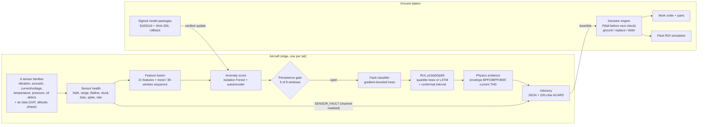

# Architecture

Models run in ONNX Runtime (FP32) on the edge; the tree ensembles can also be exported as tensor
operations (Hummingbird) for TensorRT. Code map: `simulator.py` (incl. flight phases, `LiveAircraft`),
`sensor_health.py`, `features.py`, `models/`, `pipeline.py`, `physics.py`, `acars.py`, `decision.py`,
`roi.py`, `signing.py`, `onnx_export.py`, `server/` + `web/`, `datasets/ims.py`, `cmapss.py`, `report.py`.
