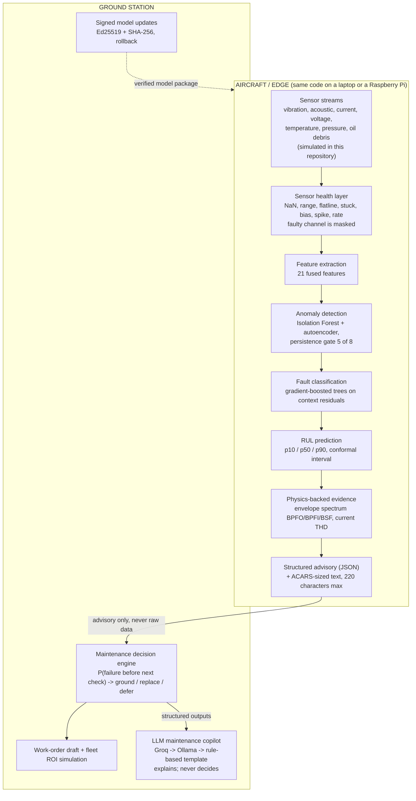

# Architecture

AeroMind V2 has two halves. The **edge** half runs next to the sensors and is deterministic. The
**ground** half turns advisories into maintenance decisions and, optionally, plain-language
explanations from a ground-side LLM. The LLM never feeds back into the edge half.



## Where the truth lives

| Question | Answered by | Never answered by |
|---|---|---|
| Is something anomalous? Which fault? How confident? | edge models (anomaly, classifier) | the LLM |
| How much life remains (p10/p50/p90)? | edge RUL model | the LLM |
| Is a sensor broken? | sensor health layer | the LLM |
| Why does the system believe it? | physics evidence computed from raw signals | the LLM |
| Ground, replace or defer? Risk? Cost? | decision engine and ROI code | the LLM |
| "Explain that to an engineer", "draft a work order text" | LLM copilot, from the structured outputs above | |

## Code map (`src/aeromind/`)

| Package | Contents |
|---|---|
| `core/` | `config`, `simulator` (sensors, flight phases, `LiveAircraft`), `features`, `alerts` (advisory schema), `train` (`ModelBundle`) |
| `models/` | `anomaly`, `classifier`, `rul`, `lstm`, `conformal` |
| `edge/` | `pipeline` (`EdgePipeline`), `sensor_health`, `onnx_export` (ONNX export and runtime), `bench`, `agent` (edge agent) |
| `physics/` | envelope-spectrum and harmonic evidence |
| `maintenance/` | `decision` (policy, work orders), `roi` (fleet cost simulation) |
| `communications/` | `acars` (220-character encoding and decoding) |
| `security/` | `signing` (Ed25519 signed model packages, slots, rollback) |
| `learning/` | `federated` (FedAvg experiments) |
| `datasets/` | `cmapss`, `ims` (public datasets) |
| `evaluation/` | `evaluate` (closed-loop metrics) |
| `report/` | `evidence_report` (one-command evidence), `dashboard` (static HTML replay) |
| `llm/` | provider abstraction, router, context builder, prompts, schemas, safety, fallback, knowledge retrieval, copilot |
| `server/` | `app` (FastAPI + WebSocket), `fleet` (simulated fleet), `remote` (edge-agent ingest); `web/index.html` is the ground-station page |
| `cli.py` | the `aeromind` command |

## The Raspberry Pi path

```
 LAPTOP: aeromind serve  <---- HTTP /api/ingest (advisories) ----  RASPBERRY PI 5: aeromind edge-agent
 dashboard, decisions, LLM copilot                                   EdgePipeline + ONNX Runtime
```

`aeromind edge-agent` runs the same `EdgePipeline` and `OnnxBundle` as the simulated fleet, then posts the
advisories it already produces. See [deployment.md](deployment.md) and
[../deploy/raspberry-pi/README.md](../deploy/raspberry-pi/README.md). Hardware results are pending.

## Models in the edge bundle

Models run in ONNX Runtime (FP32, CPU). The tree ensembles can also be exported as tensor operations
(Hummingbird) for TensorRT; that export has not been built with TensorRT or run on a Jetson. Details and
parity checks are in [technical-notes.md](technical-notes.md).
